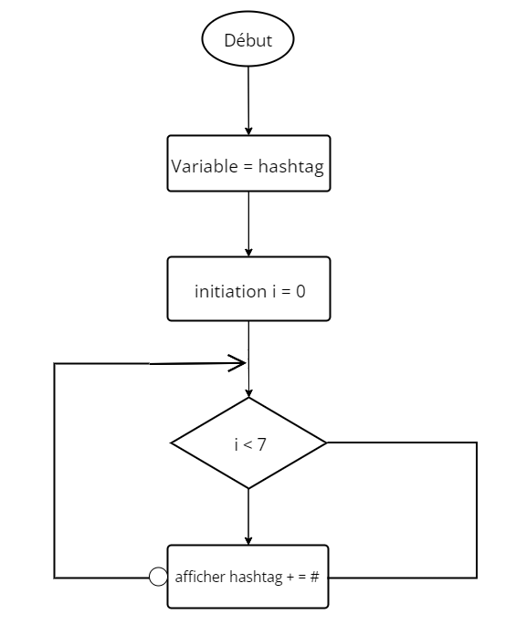

## Exercice 01 : _Looping a triangle_

<p>Écrivez une boucle qui fait sept appels à console.log pour produire le triangle suivant :</p>

```
#
##
###
####
#####
######
#######
```

### Algorigramme :

;

### PseudoCode :

```
DEBUT
 VARIABLE hashtag : CARACTÈRE;
   POUR i allant de 1 à 8;
    AFFICHER (hashtag += "#");
   FIN_POUR
FIN
```
