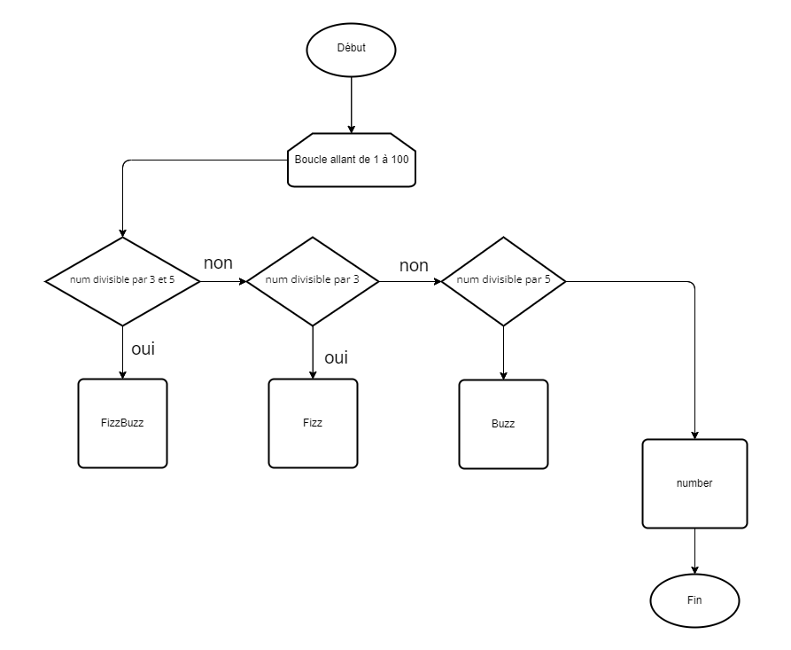

## Exercice 02 : _FizzBuzz_

<p>Écrivez un programme qui utilise console.log pour afficher tous les nombres de 1 à 100, à deux exceptions près. Pour les nombres divisibles par 3, afficher "Fizz" à la place du nombre, et pour les nombres divisibles par 5 (et non 3), afficher "Buzz" à la place.</p>

<p>
Lorsque cela fonctionne, modifiez votre programme pour qu'il affiche "FizzBuzz" pour les nombres divisibles par 3 et 5 (et qu'il affiche toujours "Fizz" ou "Buzz" pour les nombres divisibles par un seul d'entre eux).
</p>

### Algorigramme :



### PseudoCode :

```
DEBUT
 VARIABLE num : ENTIER
  POUR i allant de 1 à 100;
   DEBUT SI
    SI (num % 3 == 0 et num % 5 == 0) ALORS
     AFFICHER FizzBuzz;
    SINON SI (num % 3 == 0);
     AFFICHER Fizz;
    SINON SI (num % 5 == 0);
     AFFICHER Buzz;
    SINON
     AFFICHER num;
    FIN_SI
    FIN_SI
  FIN_POUR
FIN
```
