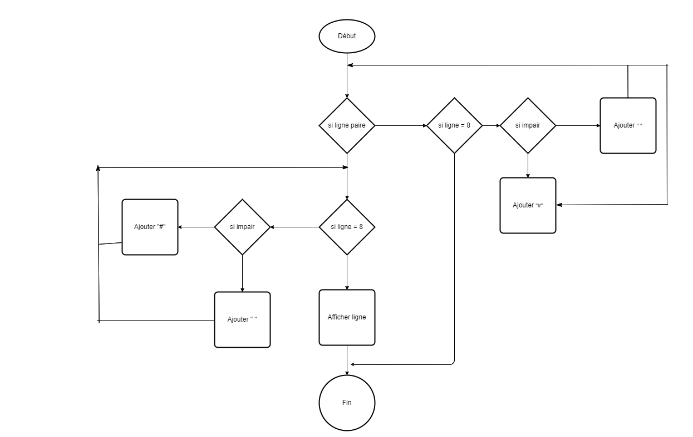

## Exercice 03 : _ChessBoard_

<p>
Écrivez un programme qui crée une chaîne représentant une grille 8×8, en utilisant des caractères de nouvelle ligne pour séparer les lignes. À chaque position de la grille, il y a soit un espace, soit un caractère "#". Les caractères doivent former un échiquier.
</p>

<p>En passant cette chaîne à console.log, vous devriez obtenir quelque chose comme ceci :</p>

```
 # # # #
# # # #
 # # # #
# # # #
 # # # #
# # # #
 # # # #
# # # #
```

<p>Lorsque vous avez un programme qui génère ce modèle, définissez une liaison taille = 8 et modifiez le programme pour qu'il fonctionne pour n'importe quelle taille, en produisant une grille de la largeur et de la hauteur données.</p>

### Algorigramme :



### PseudoCode :

```
DEBUT
 VARIABLE taille : ENTIER
 VARIABLE chessboard : CARACTÈRE

  taille <- 8;
  chessboard <- ""

   POUR y allant de 1 à taille
    POUR x allant de 1 à taille
     SI (x + y) % 2 == 0 ALORS
      chessboard += "#";
     SINON
      chessboard += " ";
     FIN_SI
    FIN_POUR
    chessboard += "\n";
   FIN_POUR
FIN

```
